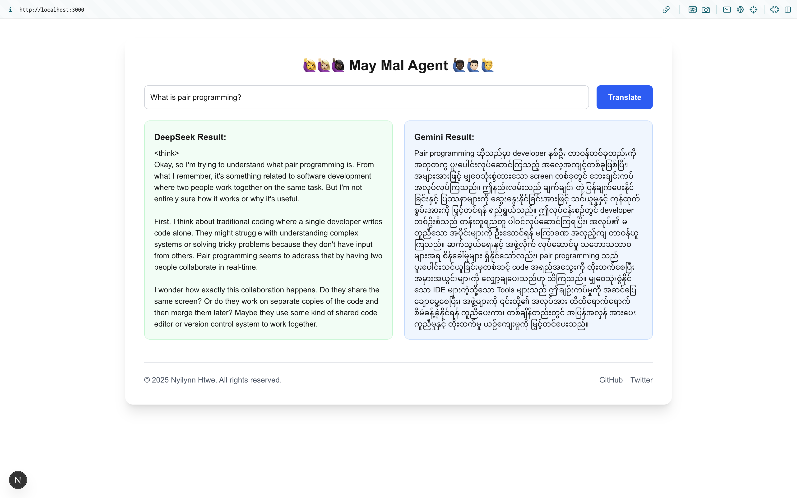

# May Mal AI Agent Documentation 🌍

## Overview

A multilingual interface that helps non-English speakers understand content through:

* DeepSeek R1 Local LLM (via Ollama) - Contextual reasoning and English processing

*  Native language translation using Gemini 2.5 Pro

## Features
🚀 Real-time translation workflow

🌐 Local language support through models

⚡ Instant results with loading indicators

🔒 Fully local operation (except DeepSeek API)

## Technical Architecture

### Work flow

1.Get User Input: Capture the user's prompt.

2.DeepSeek R1 Processing: Send the input to DeepSeek R1 for contextual analysis.

3.Retrieve Response: Receive the analyzed output from DeepSeek R1.

4.Gemini 2.5 Pro Translation: Forward the DeepSeek response to Gemini 2.5 Pro for translation.

5.Display Output: Present the translated content to the user.
   
### Key Technologies
1. Next.js: Used for the frontend and API routes.
2. Ollama: Facilitates local model execution.
3. DeepSeek: Provides deep contextual understanding.
4. Gemini 2.5 Pro: Enables smooth local language translation.
5. React Hot Toast: Delivers user feedback through notifications.
   

## Setup Instructions

### Requirements
1. Node.js 18+
2. Ollama: Must be running locally.
3. Gemini api key from [Google AI Studio](https://aistudio.google.com/)

## Configuration
In src/app/utils/constants.ts:

Gemini API Key: Insert your Gemini API key.

Local Language: Set your desired language by modifying the LOCAL_LANGUAGE variable.

---
Feel free to enhance or contribute to this project. For any questions or suggestions, please contact the project maintainers.